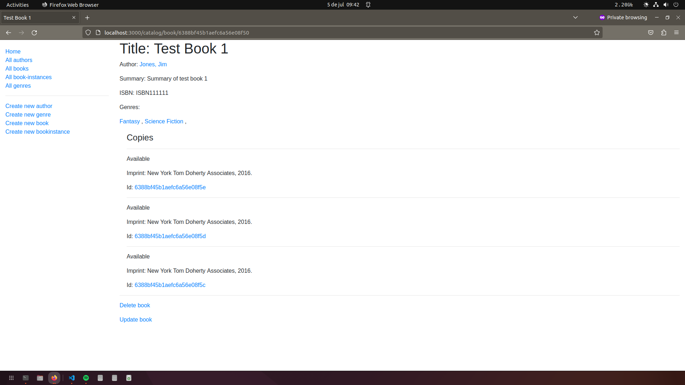
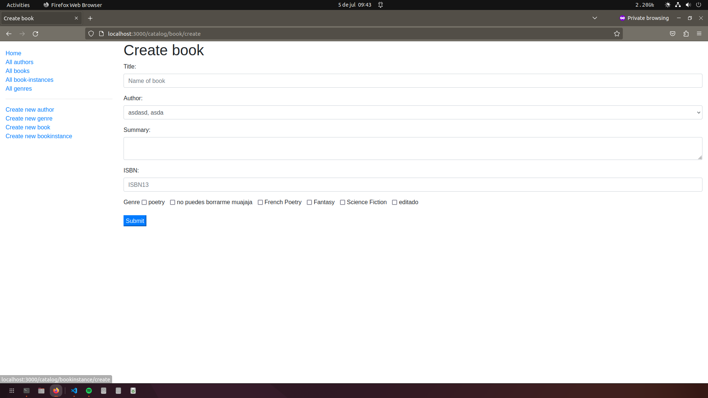

<a name="readme-top"></a>

<!-- PROJECT LOGO -->
<br />
<div align="center">

  <h2 align="center">LocalLibrary</h2>

  <p align="center"><a href="https://locallibrary-tvvg.onrender.com">Link para vistiar la aplicación</a> 👈</p>
</div>

<!-- TABLE OF CONTENTS -->
<details>
  <summary>Tabla de contenidos</summary>
  <ol>
    <li>
      <a href="#sobre-este-proyecto">Sobre este proyecto</a>
      <ul>
        <li><a href="#construido-con">Construido con</a></li>
      </ul>
    </li>
    <li>
      <a href="#como-levantar-la-app">Como levantar la App</a>
      <ul>
        <li><a href="#prerequisitos">Prerequisitos</a></li>
        <li><a href="#instalación">Instalación</a></li>
      </ul>
    </li>
    <li><a href="#qué-aprendí">Qué aprendí</a></li>
    <li><a href="#ejemplos">Ejemplos</a></li>
  </ol>
</details>

## Sobre este proyecto
Una aplicación para manejar el catálogo de una biblioteca.
Construida en base a la guia de [MDN](https://developer.mozilla.org/en-US/docs/Learn/Server-side/Express_Nodejs/Tutorial_local_library_website).

<p align="right">(<a href="#readme-top">Volver al inicio</a>)</p>

### Construido con
* NodeJs con express para el backend
* EJS para el Front-End
* mongoDB para base de datos
* moongose para interactuar con la base de datos

<p align="right">(<a href="#readme-top">Volver al inicio</a>)</p>

## Como levantar la App

### Prerequisitos
Para correr la aplicación localmente vas a tener que tener tu propia base de datos en mongoDB. Una vez creada la base de datos vamos a introducir la info sensible como variables de entorno:
* Crear un archivo ".env" en la raíz del proyecto y en este escribir
  ```sh
  DB_USERNAME=TuUsuario
  DB_PASSWORD=TuContraseña

  ```
  
### Instalación
* Instalar las dependencias:
  ```sh
  npm install
  ```
* Una vez instaladas las dependencias podremos correr la aplicación con el siguiente comando:
  ```sh
  npm run devstart
  ```
  
<p align="right">(<a href="#readme-top">Volver al inicio</a>)</p>

## Qué aprendí
Con este proyecto aprendí a crear, conectar e interactuar con una base de datos de MongoDB para guardar los datos de la aplicación.

  <p align="right">(<a href="#readme-top">Volver al inicio</a>)</p>

## Ejemplos
Algunas capturas de ejemplo para ver cómo es la App
* Detalle de un libro
  <div align="center">
    
  </div>
* Cargar libro nuevo
  <div align="center">
    
  </div>


  <p align="right">(<a href="#readme-top">Volver al inicio</a>)</p>
